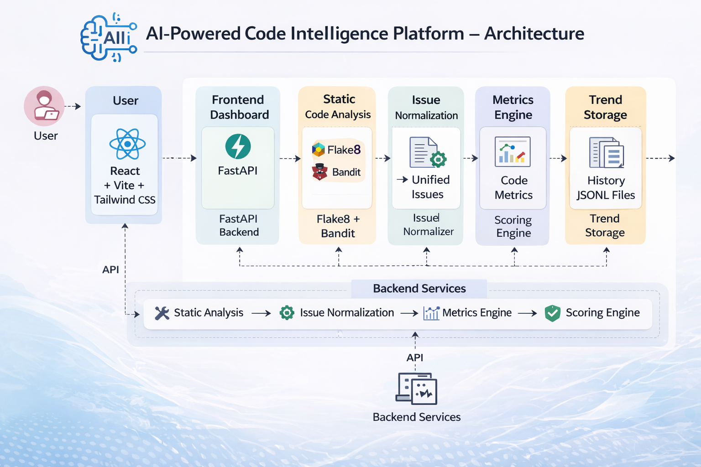
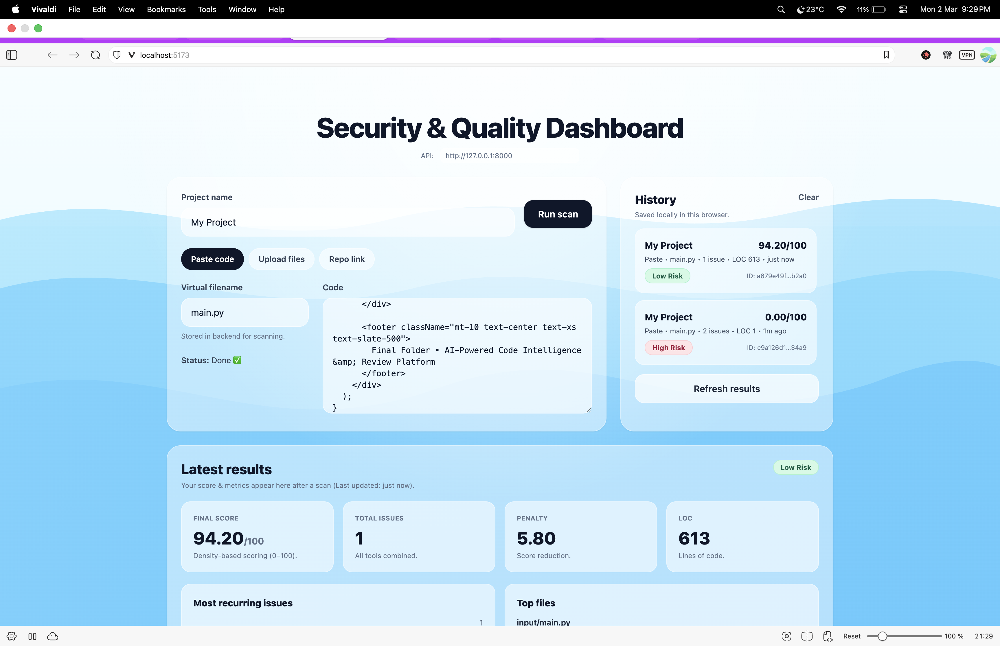

# AI-Powered Code Intelligence & Review Platform

A hybrid static analysis and AI-enhanced code intelligence platform designed to evaluate software quality, security risk, and maintainability using unified issue normalization, advanced metrics, and density-based scoring.

---

## 🚀 Project Overview

This platform analyzes source code using static analysis tools, normalizes issues into a unified schema, computes advanced engineering metrics, and produces a density-based risk score.

It is designed to go beyond basic linting by:

- Unifying multiple tools into a single issue model
- Calculating weighted risk using severity density
- Tracking historical trends
- Highlighting top refactor priorities
- Providing structured metrics for engineering decisions

---

## 🏗 Architecture




---
## 🖥 Dashboard Preview


---

## 🧠 Key Features

### ✅ Unified Issue Model
All tools are normalized into:


UnifiedIssue {
tool,
rule_id,
severity (low | medium | high),
confidence,
file,
line,
message,
category
}


---

### 📊 Advanced Metrics

- Total issues
- Severity breakdown
- Issues by tool
- Lines of Code (LOC)
- Top refactor priority files
- Heatmap (file-wise severity counts)
- Most recurring issues
- Historical trend tracking

---

### 🎯 Density-Based Scoring Engine

Score calculation considers:

- Severity weights
- Issue density per KLOC
- Logarithmic penalty scaling
- Final score clamped to 0–100


final_score = clamp(100 - penalty, 0, 100)


Risk Levels:

- 80–100 → Low Risk
- 50–79  → Medium Risk
- 0–49   → High Risk

---

### 📈 Trend Tracking

Each scan appends:


storage/history/<project_key>/trend.jsonl


Tracked fields:

- Timestamp
- Total issues
- Severity counts
- Score
- LOC

This allows future predictive analytics and risk forecasting.

---

## 🖥 Tech Stack

### Backend
- FastAPI
- Python 3.x
- Flake8
- Bandit

### Frontend
- React
- Vite
- TypeScript
- TailwindCSS
- Recharts

---

## 📁 Project Structure

```text
final-folder/
├─ backend/
│  ├─ app/
│  │  ├─ api/
│  │  │  └─ routes/
│  │  ├─ services/
│  │  └─ main.py
│  └─ storage/
├─ frontend/
│  ├─ src/
│  │  ├─ api/
│  │  ├─ components/
│  │  ├─ hooks/
│  │  ├─ pages/
│  │  ├─ types/
│  │  ├─ App.tsx
│  │  └─ main.tsx
│  └─ public/
└─ docs/
   ├─ architecture.png
   └─ dashboard.png

---


## ⚙️ How to Run

### 1️⃣ Backend

```bash
cd backend
python -m venv .venv
source .venv/bin/activate
pip install -r requirements.txt
uvicorn app.main:app --reload

Open:

http://127.0.0.1:8000/docs
2️⃣ Frontend
cd frontend
npm install
npm run dev

Open:

http://localhost:5173
🧪 Scan Workflow

Create Scan

Upload ZIP / Paste Code / Repo Link

Run Static Analysis

Normalize Issues

Generate Metrics

Compute Score

Store Trend

Render Dashboard

🔮 Future Enhancements

LLM-powered issue explanation

AI refactor suggestions

Predictive risk modeling

Pull request bot integration

CI/CD integration

Multi-language support

Developer impact analysis

🎓 Academic Relevance

This project demonstrates:

Static analysis integration

Unified data modeling

Risk scoring algorithms

Software metrics engineering

Full-stack system design

Scalable architecture planning

📌 License

Educational Use – Final Year Project

👨‍💻 Author

Manoj
AI-Powered Code Intelligence & Review Platform
