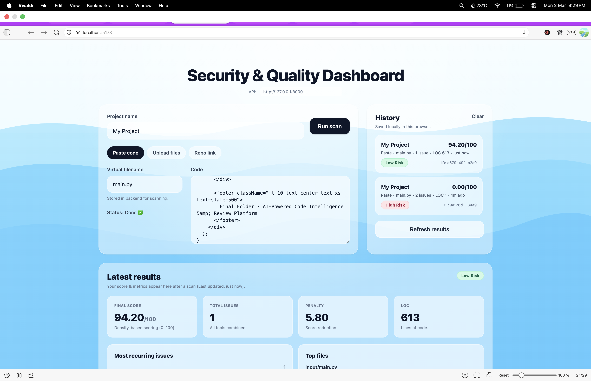

# AI-Powered Code Intelligence & Review Platform

A hybrid static-analysis and local-AI code intelligence platform designed to evaluate software quality, security risk, maintainability, and refactoring priorities.

The platform combines deterministic static-analysis tools with a locally running LLM through Ollama. Static-analysis results remain authoritative for issue detection, severity, metrics, and scoring, while the AI layer explains important findings in simple English and provides practical fixes based on the actual source code.

---

## 🚀 Project Overview

The platform accepts source code through multiple ingestion methods, runs static analysis, normalizes findings into a unified issue model, calculates engineering metrics, produces a deterministic risk score, and optionally enriches important findings using a local LLM.

### Current workflow

```text
Paste Code / Upload ZIP / GitHub Repository
                    ↓
               Code Ingestion
                    ↓
             Static Analysis
          ┌─────────┴─────────┐
          ↓                   ↓
       Flake8              Bandit
          └─────────┬─────────┘
                    ↓
           Issue Normalization
                    ↓
             Metrics Engine
                    ↓
          Deterministic Scoring
                    ↓
          AI Enrichment Layer
             (Ollama + Qwen3)
                    ↓
              Scan Storage
                    ↓
               Dashboard
```

The AI layer is an enrichment layer rather than the source of truth. If the local LLM is unavailable, deterministic analysis and rule-based explanations remain available.

---

## 🧠 Local AI Code Review

The project now includes a fully local AI review pipeline using **Ollama** and **Qwen3 8B**.

### Why local AI?

- Source code does not need to be sent to a cloud LLM provider for the review step.
- The model runs locally on the developer's machine.
- No OpenAI API key is required for the current AI implementation.
- The deterministic analysis pipeline remains independent of the LLM.

### AI runtime

- Runtime: Ollama
- Default model: `qwen3:8b`
- Default endpoint: `http://localhost:11434/api/generate`
- JSON-formatted model responses
- Low-temperature generation for more consistent explanations
- Python standard-library HTTP client; no OpenAI SDK is required

The model can be changed with:

```bash
export OLLAMA_MODEL=qwen3:8b
```

The request timeout can be configured with:

```bash
export OLLAMA_TIMEOUT_SECONDS=120
```

### Source-code-aware explanations

For important findings, the backend reads a small source-code window around the reported line and sends that context to the local model.

The context contains approximately five lines before and five lines after the finding, with the flagged line marked for clarity. The path is resolved safely inside the scan input directory before the source file is read.

This allows the AI to explain the actual code instead of simply repeating the scanner message.

### AI issue output

For selected findings, the AI produces:

- **Explanation** — what the code is doing and why it was flagged
- **Fix** — a practical fix for the specific code
- **Risk** — the realistic potential risk
- **Impact** — the realistic consequence if the issue causes a problem

The AI is instructed to:

- Treat scanner severity as authoritative
- Never increase the supplied severity
- Avoid inventing attacker capabilities or attack scenarios
- Distinguish potential risks from confirmed vulnerabilities
- Use supplied source code as the primary evidence
- Avoid describing low/medium findings as high/critical
- Give code-specific rather than generic fixes

---

## 🧠 AI Project Summary

The local LLM also generates a project-level explanation after the deterministic scan.

The summary can contain:

- Project headline
- Security overview
- Code-quality overview
- Priority action
- Practical recommendations
- Score explanation

The AI receives the deterministic score, risk level, metrics, and important findings as input.

**The AI does not calculate or modify the project's numerical score.** The final score and risk level continue to come from the deterministic scoring engine.

---

## 🔐 Hybrid Analysis Architecture

The project deliberately separates deterministic analysis from AI interpretation.

### Deterministic layer

Responsible for:

- Running static-analysis tools
- Detecting issues
- Normalizing findings
- Calculating metrics
- Calculating the numerical score
- Determining the risk level
- Maintaining historical scan data

### AI layer

Responsible for:

- Explaining selected findings
- Understanding source-code context
- Suggesting practical fixes
- Explaining project health
- Providing project-level recommendations

This separation prevents an LLM from arbitrarily changing security severity or the numerical project score.

---

## 🧩 Unified Issue Model

Static-analysis findings are normalized into a common structure so different tools can be displayed and processed consistently.

```text
UnifiedIssue {
    tool,
    rule_id,
    severity,
    confidence,
    file,
    line,
    message,
    category
}
```

Current severity levels:

- Low
- Medium
- High

AI-enriched findings may additionally contain:

```text
explanation
fix
risk
impact
priority_score
priority
explanation_source
```

---

## 🔎 Static Analysis

The current Python analysis pipeline uses:

### Flake8

Used for Python code-quality and style findings such as formatting, unused imports, unused variables, syntax problems, and other linting violations.

### Bandit

Used for Python security-oriented static analysis, including potentially unsafe operations and security-sensitive coding patterns.

The scanner findings are normalized before being passed into the metrics, scoring, and AI layers.

---

## 🎯 AI Finding Prioritization

The backend ranks findings before sending them to the local LLM.

Priority considers factors such as:

- Scanner severity
- Analysis tool
- Security rules
- Important correctness rules

Only the highest-priority findings are sent for detailed AI enrichment rather than sending every issue to the model. This reduces unnecessary model processing while keeping important findings understandable.

---

## 📊 Advanced Metrics

The platform calculates and displays engineering metrics including:

- Total issues
- Severity breakdown
- Issues by tool
- Lines of Code (LOC)
- Issue density
- Top refactor-priority files
- File-wise severity heatmap
- Most recurring issues
- Historical scan trends
- Penalty breakdown

These metrics are generated independently of the AI layer.

---

## 🎯 Density-Based Scoring Engine

The scoring engine evaluates project health using issue severity and issue density.

The calculation considers:

- Severity weights
- Issue density per KLOC
- Penalty scaling
- Final score clamped to 0–100

Conceptually:

```text
final_score = clamp(100 - penalty, 0, 100)
```

### Risk levels

| Score | Risk Level |
|---:|---|
| 80–100 | Low Risk |
| 50–79 | Medium Risk |
| 0–49 | High Risk |

The AI never replaces this calculation.

---

## 📈 Historical Trend Tracking

Historical scan data tracks values such as:

- Timestamp
- Total issues
- Severity counts
- Score
- Lines of Code

Trend data is stored under:

```text
backend/storage/history/<project_key>/trend.jsonl
```

The dashboard can visualize changes in project quality over time.

---

## 🖥 Dashboard

The React dashboard provides an interactive interface for creating and reviewing scans.

### Scan input modes

- **Paste Code** — analyze source code entered directly in the dashboard
- **Upload ZIP** — analyze an uploaded project archive
- **Repository** — analyze a GitHub repository

### Dashboard capabilities

- Create and monitor scans
- Display project score and risk level
- Show total issues and LOC
- Show severity distribution
- Show issues by analysis tool
- Show top risky findings
- Show AI explanations and fixes
- Show security and quality summaries
- Show priority actions and recommendations
- View recurring issues
- View file-level heatmap data
- View historical scan records
- View project trend charts
- Inspect raw scan information
- Copy issue information for further use

The dashboard distinguishes AI-enriched information from deterministic scan results.

---

## 🏗 Architecture


### Major backend layers

```text
backend/app/
├─ api/
│  └─ routes/
├─ services/
│  ├─ ai/
│  ├─ history/
│  ├─ ingestion/
│  ├─ pipeline/
│  ├─ processors/
│  ├─ runners/
│  └─ scoring/
└─ main.py
```

### AI service

```text
backend/app/services/ai/
├─ generator.py
├─ llm_generator.py
└─ rules.py
```

- `generator.py` coordinates AI enrichment and deterministic fallback logic.
- `llm_generator.py` communicates with the local Ollama HTTP API.
- `rules.py` contains deterministic rule-based explanations and fallback guidance.

---

## 🖥 Dashboard Preview



---

## 🛠 Tech Stack

### Backend

- Python 3.x
- FastAPI
- Flake8
- Bandit
- Ollama
- Qwen3 8B
- Python standard-library HTTP client for Ollama communication

### Frontend

- React
- TypeScript
- Vite
- TailwindCSS
- Recharts

### Storage

- Local filesystem storage
- JSON scan results
- JSONL historical trend data

---

## 📁 Project Structure

```text
ai-code-intelligence-platform/
├─ backend/
│  ├─ app/
│  │  ├─ api/
│  │  │  └─ routes/
│  │  ├─ services/
│  │  │  ├─ ai/
│  │  │  │  ├─ generator.py
│  │  │  │  ├─ llm_generator.py
│  │  │  │  └─ rules.py
│  │  │  ├─ history/
│  │  │  ├─ ingestion/
│  │  │  ├─ pipeline/
│  │  │  ├─ processors/
│  │  │  ├─ runners/
│  │  │  └─ scoring/
│  │  └─ main.py
│  └─ storage/
│
├─ frontend/
│  ├─ src/
│  │  ├─ api/
│  │  ├─ components/
│  │  ├─ hooks/
│  │  ├─ pages/
│  │  ├─ types/
│  │  ├─ App.tsx
│  │  └─ main.tsx
│  └─ public/
│
└─ docs/
   ├─ architecture.png
   └─ dashboard.png
```

---

## ⚙️ How to Run

### 1️⃣ Start Ollama

Install Ollama and make sure the local server is running.

Pull the default model:

```bash
ollama pull qwen3:8b
```

Verify that the model is available:

```bash
ollama list
```

The backend expects Ollama at:

```text
http://localhost:11434
```

### 2️⃣ Backend

```bash
cd backend
python -m venv .venv
source .venv/bin/activate
pip install -r requirements.txt
uvicorn app.main:app --reload
```

Open:

```text
http://127.0.0.1:8000/docs
```

### 3️⃣ Frontend

Open a second terminal:

```bash
cd frontend
npm install
npm run dev
```

Open:

```text
http://localhost:5173
```

---

## 🧪 Scan Workflow

```text
1. Create Scan
2. Paste Code / Upload ZIP / Enter Repository
3. Ingest Source Code
4. Run Static Analysis
5. Normalize Issues
6. Generate Engineering Metrics
7. Compute Deterministic Score
8. Rank Important Findings
9. Read Source-Code Context
10. Generate Local AI Explanations
11. Generate AI Project Summary
12. Store Scan and History
13. Render Dashboard
```

If the local LLM is unavailable, deterministic analysis and rule-based explanations remain available.

---

## 🔒 AI Safety and Accuracy Design

The AI layer is designed to reduce misleading security explanations.

The model is instructed to:

- Respect scanner-provided severity
- Avoid severity inflation
- Avoid invented exploitation scenarios
- Avoid unsupported claims of data exposure or remote code execution
- Use source code as evidence when available
- Distinguish potential vulnerabilities from confirmed vulnerabilities
- Explain URL-related findings using the actual URL-handling code
- Produce concise, practical fixes

This is important for security findings where a scanner may identify a potentially risky coding pattern without proving that the application is exploitable.

---

## 🔮 Future Enhancements

Planned extensions include:

- C++ static-analysis support
- Java static-analysis support
- Additional language-specific analysis tools
- AI-assisted refactoring workflows
- Predictive risk modeling
- Pull-request review integration
- CI/CD integration
- GitHub Actions integration
- Developer impact analysis
- More advanced historical analytics

Multi-language support is a planned extension and is not represented as a currently supported production feature until its analysis pipeline is implemented and tested.

---

## 🎓 Academic Relevance

This project demonstrates:

- Static-analysis integration
- Local LLM integration
- Source-code-aware AI analysis
- Unified data modeling
- Risk-scoring algorithms
- Software metrics engineering
- Historical trend analysis
- Full-stack system design
- API-based backend architecture
- AI safety and output validation
- Separation of deterministic analysis and probabilistic AI reasoning
- Scalable architecture planning

The project combines conventional software-engineering analysis with a locally hosted AI layer to create a practical code-intelligence workflow.

---

## 📌 License

Educational Use – Final Year Project

---

## 👨‍💻 Authors

- Manoj
- Amul
- Bhuvan
- Praful

**AI-Powered Code Intelligence & Review Platform**
