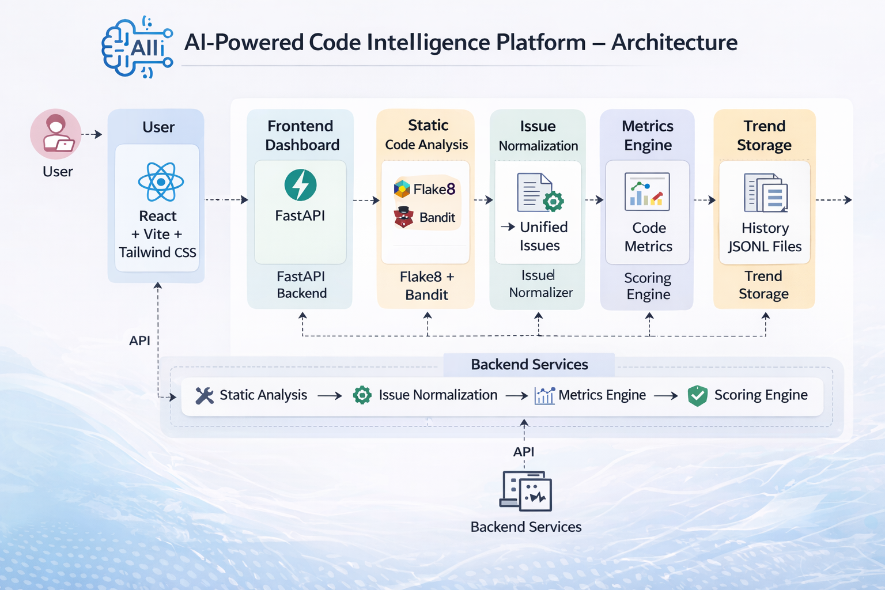

# AI-Powered Code Intelligence & Review Platform

A hybrid static-analysis and local-AI code intelligence platform designed to evaluate software quality, security risk, maintainability, and refactoring priorities across supported source-code languages.

The platform combines deterministic static-analysis tools with a locally running LLM through Ollama. Static-analysis results remain authoritative for issue detection, severity, metrics, and scoring, while the AI layer explains important findings in simple English and provides practical fixes based on the actual source code.

---

## 🚀 Project Overview

The platform accepts source code through multiple ingestion methods, runs language-appropriate static analysis, normalizes findings into a unified issue model, calculates engineering metrics, produces a deterministic risk score, and enriches important findings using a local LLM.

### Current workflow

```text
Paste Code / Upload ZIP / GitHub Repository
                    ↓
               Code Ingestion
                    ↓
             Language Detection
          /        |        |       \
         /         |        |        \
   Python         Java      C       C++
     ↓              ↓       \       /
Flake8+Bandit      PMD       \     /
         \          |         Cppcheck
          \         |          /
           └────────┴─────────┘
                    ↓
           Issue Normalization
                    ↓
             Metrics Engine
                    ↓
          Deterministic Scoring
                    ↓
          AI Enrichment Layer
             (Ollama + Qwen3)
                    ↓
              Scan Storage
                    ↓
               Dashboard
```

The AI layer is an enrichment layer rather than the source of truth. If the local LLM is unavailable, deterministic analysis and rule-based explanations remain available.

---

## 🧠 Local AI Code Review

The project includes a fully local AI review pipeline using **Ollama** and **Qwen3 8B**.

### Why local AI?

- Source code does not need to be sent to a cloud LLM provider for the review step.
- The model runs locally on the developer's machine.
- No OpenAI API key is required for the current AI implementation.
- The deterministic analysis pipeline remains independent of the LLM.

### AI runtime

- Runtime: Ollama
- Default model: `qwen3:8b`
- Default endpoint: `http://localhost:11434/api/generate`
- JSON-formatted model responses
- Low-temperature generation for more consistent explanations
- Python standard-library HTTP client; no OpenAI SDK is required

### Source-code-aware explanations

For important findings, the backend reads a small source-code window around the reported line and sends that context to the local model.

The context contains approximately five lines before and five lines after the finding, with the flagged line marked for clarity. The path is resolved safely inside the scan input directory before the source file is read.

This works for supported source files, including Java findings produced by PMD and C/C++ findings produced by Cppcheck.

### AI issue output

For selected findings, the AI produces:

- **Explanation** — what the code is doing and why it was flagged
- **Fix** — a practical fix for the specific code
- **Risk** — the realistic potential risk
- **Impact** — the realistic consequence if the issue causes a problem

The AI is instructed to:

- Treat scanner severity as authoritative
- Never increase the supplied severity
- Avoid inventing attacker capabilities or attack scenarios
- Distinguish potential risks from confirmed vulnerabilities
- Use supplied source code as the primary evidence
- Avoid describing low/medium findings as high/critical
- Give code-specific rather than generic fixes

---

## 🧩 Unified Issue Model

Static-analysis findings are normalized into a common structure so different tools can be displayed and processed consistently.

```text
UnifiedIssue {
    tool,
    rule_id,
    severity,
    confidence,
    file,
    line,
    message,
    category
}
```

Current severity levels:

- Low
- Medium
- High

---

## 🔎 Static Analysis

The project currently supports language-specific static analysis.

### Python

#### Flake8

Used for Python code-quality and style findings such as formatting, unused imports, unused variables, syntax problems, and other linting violations.

#### Bandit

Used for Python security-oriented static analysis, including potentially unsafe operations and security-sensitive coding patterns.

### Java

#### PMD

PMD is used for Java static analysis. PMD findings are converted into the platform's unified issue model before metrics, scoring, and AI enrichment.

PMD priority is mapped into the platform severity model:

- PMD priority 1–2 → High
- PMD priority 3 → Medium
- PMD priority 4–5 → Low

### C and C++

#### Cppcheck

Cppcheck is used for C and C++ static analysis. The integration supports common C/C++ source and header extensions and converts Cppcheck findings into the same unified issue model used by the other scanners.

The runner requests XML output from Cppcheck and retains useful information such as rule ID, severity, message, file, line, and CWE when available.

The supported source extensions include:

- C: `.c`, `.h`
- C++: `.cc`, `.cpp`, `.cxx`, `.hh`, `.hpp`, `.hxx`

---

## 📊 Advanced Metrics

The platform calculates and displays engineering metrics including:

- Total issues
- Severity breakdown
- Issues by tool
- Lines of Code (LOC)
- Issue density
- Top refactor-priority files
- File-wise severity heatmap
- Most recurring issues
- Historical scan trends
- Penalty breakdown

LOC is calculated from the active supported-language analysis output.

These metrics are generated independently of the AI layer.

---

## 🎯 Density-Based Scoring Engine

The scoring engine evaluates project health using issue severity and issue density.

The calculation considers severity weights, issue density per KLOC, penalty scaling, and a final score clamped to 0–100.

```text
final_score = clamp(100 - penalty, 0, 100)
```

### Risk levels

| Score | Risk Level |
|---:|---|
| 80–100 | Low Risk |
| 50–79 | Medium Risk |
| 0–49 | High Risk |

The AI never replaces this calculation.

---

## 🖥 Dashboard

The React dashboard provides an interactive interface for creating and reviewing scans.

### Scan input modes

- **Paste Code** — analyze source code entered directly in the dashboard
- **Upload ZIP** — analyze an uploaded project archive containing supported source files
- **Repository** — analyze a GitHub repository containing supported source files

### Currently supported source languages

- Python (`.py`)
- Java (`.java`)
- C (`.c`, `.h`)
- C++ (`.cc`, `.cpp`, `.cxx`, `.hh`, `.hpp`, `.hxx`)

### Dashboard capabilities

- Create and monitor scans
- Display project score and risk level
- Show total issues and LOC
- Show severity distribution
- Show issues by analysis tool
- Show top risky findings
- Show AI explanations and fixes
- Show security and quality summaries
- Show priority actions and recommendations
- View recurring issues
- View file-level heatmap data
- View historical scan records
- View project trend charts
- Inspect raw scan information
- Copy issue information for further use

---

## 🏗 Architecture



### Major backend layers

```text
backend/app/
├─ api/
│  └─ routes/
├─ services/
│  ├─ ai/
│  ├─ history/
│  ├─ ingestion/
│  ├─ pipeline/
│  ├─ processors/
│  ├─ runners/
│  └─ scoring/
└─ main.py
```

### Language analysis services

```text
backend/app/services/runners/
├─ flake8_runner.py
├─ bandit_runner.py
├─ pmd_runner.py
├─ cppcheck_runner.py
└─ runner_utils.py
```

```text
backend/app/services/processors/
├─ normalize.py
├─ normalize_pmd.py
├─ normalize_cppcheck.py
└─ metrics.py
```

- `pmd_runner.py` executes PMD for Java source analysis.
- `cppcheck_runner.py` executes Cppcheck for C/C++ source analysis.
- `normalize_pmd.py` converts PMD findings into the unified issue model.
- `normalize_cppcheck.py` converts Cppcheck findings into the unified issue model.

---

## 🛠 Tech Stack

### Backend

- Python 3.x
- FastAPI
- Flake8
- Bandit
- PMD
- Cppcheck
- Java
- C/C++ analysis support
- Ollama
- Qwen3 8B

### Frontend

- React
- TypeScript
- Vite
- TailwindCSS
- Recharts

### Storage

- Local filesystem storage
- JSON scan results
- JSONL historical trend data

---

## 📁 Project Structure

```text
ai-code-intelligence-platform/
├─ backend/
│  ├─ app/
│  │  ├─ api/
│  │  │  └─ routes/
│  │  │     ├─ scans.py
│  │  │     └─ multi_language_scans.py
│  │  ├─ services/
│  │  │  ├─ ai/
│  │  │  ├─ history/
│  │  │  ├─ ingestion/
│  │  │  ├─ pipeline/
│  │  │  ├─ processors/
│  │  │  │  ├─ normalize.py
│  │  │  │  ├─ normalize_pmd.py
│  │  │  │  ├─ normalize_cppcheck.py
│  │  │  │  └─ metrics.py
│  │  │  ├─ runners/
│  │  │  │  ├─ bandit_runner.py
│  │  │  │  ├─ flake8_runner.py
│  │  │  │  ├─ pmd_runner.py
│  │  │  │  ├─ cppcheck_runner.py
│  │  │  │  └─ runner_utils.py
│  │  │  └─ scoring/
│  │  └─ main.py
│  └─ storage/
│
├─ frontend/
│  ├─ src/
│  │  ├─ api/
│  │  ├─ components/
│  │  ├─ hooks/
│  │  ├─ pages/
│  │  ├─ types/
│  │  ├─ App.tsx
│  │  └─ main.tsx
│  └─ public/
│
└─ docs/
   ├─ architecture.png
   └─ dashboard.png
```

---

## ⚙️ How to Run

### Java and PMD

Java source analysis requires a Java runtime/JDK and PMD on the system PATH.

```bash
java -version
pmd --version
```

### C and C++

C/C++ source analysis requires Cppcheck on the system PATH.

```bash
cppcheck --version
```

### Backend

```bash
cd backend
python -m venv .venv
source .venv/bin/activate
pip install -r requirements.txt
uvicorn app.main:app --reload
```

### Frontend

```bash
cd frontend
npm install
npm run dev
```

---

## 🧪 Scan Workflow

```text
1. Create Scan
2. Paste Code / Upload ZIP / Enter Repository
3. Ingest Supported Source Code
4. Run Language-Specific Static Analysis
5. Normalize Issues
6. Generate Engineering Metrics
7. Compute Deterministic Score
8. Rank Important Findings
9. Read Source-Code Context
10. Generate Local AI Explanations
11. Generate AI Project Summary
12. Store Scan and History
13. Render Dashboard
```

Current language routing:

```text
Python (.py)
   ↓
Flake8 + Bandit

Java (.java)
   ↓
PMD

C (.c/.h)
   ↓
Cppcheck

C++ (.cc/.cpp/.cxx/.hh/.hpp/.hxx)
   ↓
Cppcheck

All supported languages
 ↓
Unified Issues
 ↓
Metrics
 ↓
Scoring
 ↓
AI Enrichment
 ↓
Dashboard
```

If the local LLM is unavailable, deterministic analysis and rule-based explanations remain available.

---

## 🔮 Future Enhancements

Planned extensions include:

- Additional language-specific analysis tools
- AI-assisted refactoring workflows
- Predictive risk modeling
- Pull-request review integration
- CI/CD integration
- GitHub Actions integration
- Developer impact analysis
- More advanced historical analytics

Java and C/C++ support are now part of the implemented analysis pipeline and are no longer listed as future scope.

---

## 🎓 Academic Relevance

This project demonstrates:

- Multi-language static-analysis integration
- Unified issue normalization
- Deterministic software-quality scoring
- Local LLM integration
- Source-code-aware AI explanations
- Software security analysis
- Engineering metrics and historical trends
- Full-stack application development
